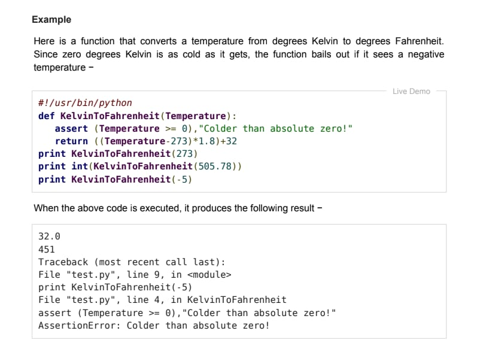
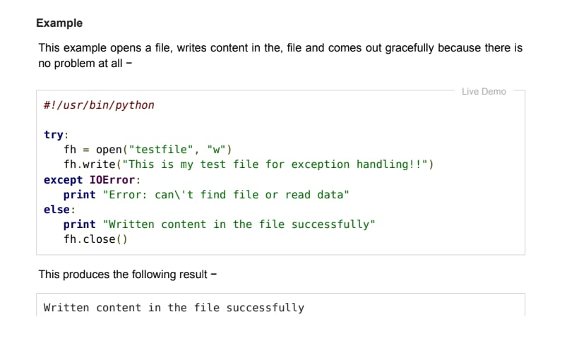
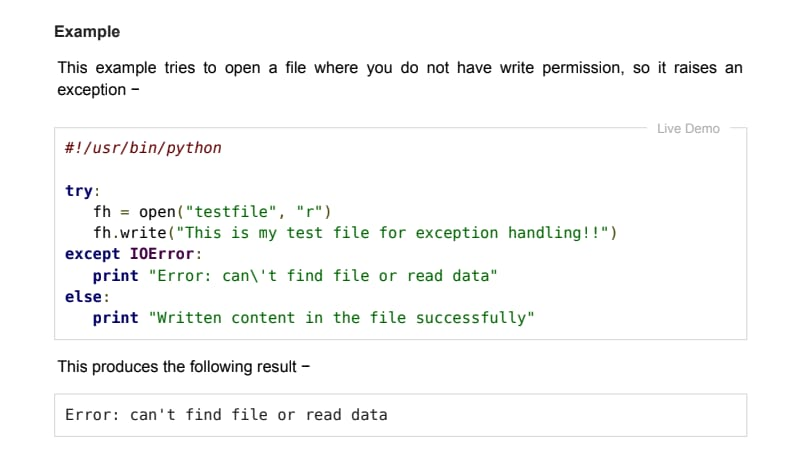
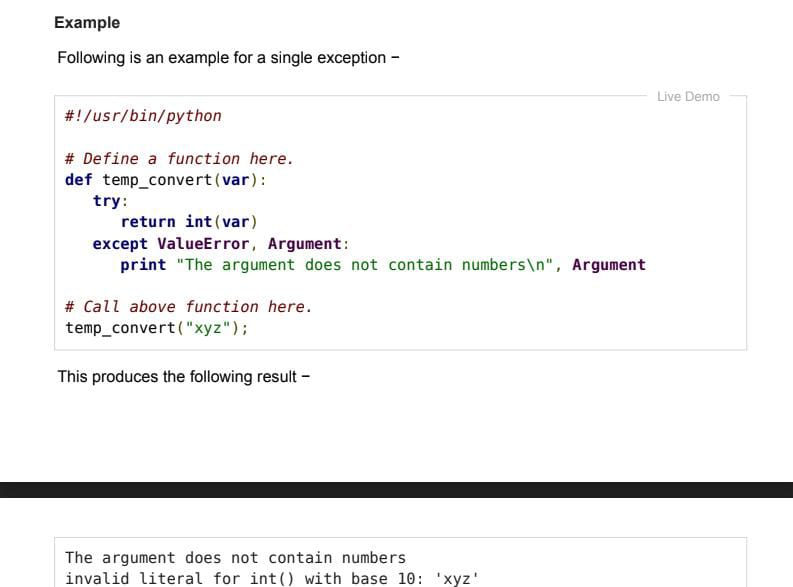
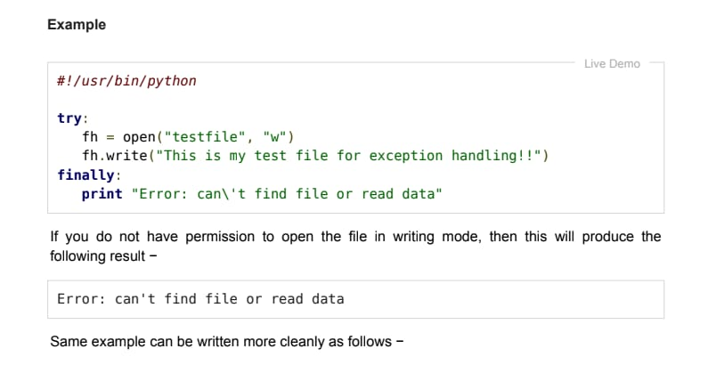
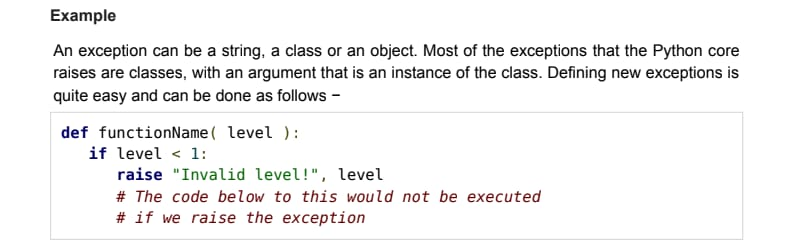

### PRAKTIKUM 9
# Inayatus Sholekhawati
# 312210200
# TI.22.A.2

### CONTOH DAN PENJELASAN MODUL PRAKTIKUM 13 (PERTEMUAN 13)
Contoh dalam bentuk foto dan penjelasan dalam bentuk tulisan.

## Exception Handling
Exception (eksepsis) adalah seatu kesalahan atau error yang terjadi saat proses programan yang berjalan. kesalahan ini kan menyebabkan program menjadi tidak normal.

## Penjelasan Ke 1


gambar di atas menjelaskan tentang fungsi yang mengubah suhu dari derajat kelviin ke derajat fahrenhait. Ketika kode seperti gambar di atas dijalankakan, makamuncul Excption yang bernama Traceback Assertion Error yang artinya terjadi error pada pertanyaan assert.

## Penjelasan ke 2


Contoh ini membuka file, menulis konten di file, dan keluar tidak ada masalah. Maka menghasilkan hasil berikut.

```Written content in the file successfully```

karena else hanya bisa dijalankan ketika try adalah True.

## Penjelasan ke 3


```Error: can't find file or read data```

munculnya Error karena r adalah read - membuka file untuk membaca, eror jika tidak ada. Dsini ingin membaca file bukan menulis maka dibawahnya ``fh = oprn("testfile", "r")`` tambahkan ``print(fh.readline())`` dan fh.write di hapus. Setelah dijalankan try dan else ditampilkan.

## Penjelasan ke 4


Menghasilkan output:

```Error: can\'t find file or read data```

Output yang dihasilkan ini tidak lah error, hal ini dikarnakan finally yang dijalankan ketika try dan excep. Dan berhasil dibuat filenya setelah dijankan.

## Penjelasan ke 5


etika dijalankan, maka muncul error. Hapus ``#!/usr/bin/python`` dan di ``except ValueError, Argument:`` ganti koma dengan as seperti ``except ValueError as Argument:`` agar tidak error. Jika dijalankan akan muncul error lagi.

```The argument does not contain numbers invalid literal for int() with base 10: 'xyz'```

kenapa? karena parameter def temp_convert harus mengandung angka.

## Penjelasan ke 6


jika dijalankan muncul SyntaxError yang artinya ada kesalahan sintaks. Pada ``raise"Invalid level!",`` level diganti dengn tanda koma dengan tanda plus. cetak def dengan angka paling besardari 1.